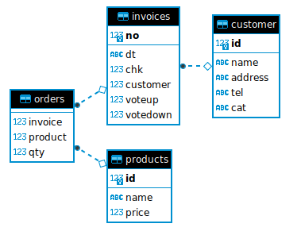

# projetInvoice
Mise à disposition des factures

# Shéma de la BDD utilisée


# Installation (linux)
```bash
 python3 -m venv venv
 source venv/bin/activate
 # Windows : 
 # . venv/Scripts/activate
 pip install -r requirements.txt
```

# Remplissage de la BDD (à partir de Faker)
```bash
source venv/bin/activate
python3 fillDB.py > invoice.sql
rm invoice.sqlite
time sqlite3 invoice.sqlite < invoice.sql
ll invoice.sqlite
```


# Run local
```bash
 source venv/bin/activate
 UVICORN_PORT=3000 SECRET=EGo uvicorn main:app --host 0.0.0.0 --reload
```
Accès au swagger: http://localhost:8000/docs

# Execution des tests
```bash
 source venv/bin/activate
 pip install pytest httpx
 pytest
```


# Création image docker

```bash
 docker build -t projetinvoice .
 docker rm -f projetinvoice
 docker run -d --name projetinvoice -p 8000:80 projetinvoice
```

Création de Task
```bash
 RESOURCE_GROUP=goudot
 LOCATION=francecentral
 ACR_NAME=gretap3acr
 IMAGE=projetinvoice
 GIT_USER=data-IA-2022
 GIT_PROJECT=projetInvoice
 GIT_BRANCH=main
 GIT_PAT=**********************

 az acr task create \
    --registry $ACR_NAME \
    --name $IMAGE \
    --image $IMAGE:latest \
    --context https://github.com/$GIT_USER/$GIT_PROJECT.git#$GIT_BRANCH \
    --file Dockerfile \
    --git-access-token $GIT_PAT
```

## Déployer ECR
```bash
 ECR_NAME=invoiceocr
 RESOURCE_GROUP=goudot
 LOCATION=francecentral
 ACR_NAME=gretap3acr
 IMAGE=invoiceocr
 ACR_PASSWORD=$(az acr credential show -n $ACR_NAME | jq -r '.passwords[0].value')
 echo ACR_PASSWORD=$ACR_PASSWORD
 DISCORD_WEBHOOK=https://discord.com/api/webhooks/********************************
 
 az container create \
    --resource-group $RESOURCE_GROUP \
    --name $ECR_NAME \
    --image $ACR_NAME.azurecr.io/$IMAGE \
    --registry-username $ACR_NAME \
    --registry-password $ACR_PASSWORD \
    --dns-name-label $ECR_NAME \
    --secure-environment-variables X=100 DISCORD_WEBHOOK=$DISCORD_WEBHOOK \
    --ports 80
```
Documentation : https://learn.microsoft.com/en-us/cli/azure/container?view=azure-cli-latest

Suppression instance !!!
```bash
 az container delete--resource-group $RESOURCE_GROUP \
    --name $ECR_NAME
```


Transfert image docker local -> datalab
```bash
 docker save projetinvoice | ssh -C goudot@datalab-mame.myconnectech.fr docker load
```

Graphana
```sql
SELECT count(*) AS N,
	CAST(strftime('%s', substr(dt,0,11)||" 00:00:00") as INTEGER) AS time
from invoices
WHERE time >= $__from / 1000 and time < $__to / 1000
group by substr(dt,0,11)
```